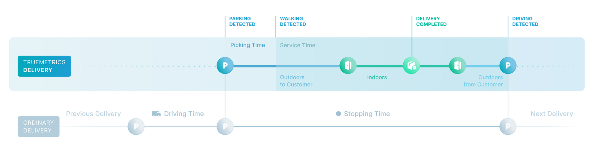
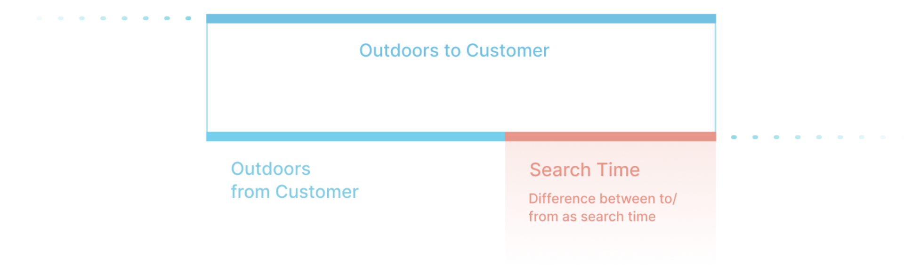

# Export of truemetrics

By default, you have two options for accessing data from truemetrics. The first and most widely used method is a batch export of all your data as a Parquet file. Alternatively, we offer a customer-specific REST API tailored to particular use cases. In this section of the documentation, we will focus on batch export; for more details and examples about the REST API, please refer to the [API Reference](https://docu.truemetrics.cloud/api-reference/endpoint/parkingPlaces).

The data export typically includes two types of data: **Stop KPI Data** and **Location Data**.

* **Stop KPI Data**: Contains detailed *time* information about each stop or delivery.
* **Location Data**: Contains detailed *location* information (i.e. the recorded parking places and entrances).

## Stop KPI Data
Stop KPI data is typically exported in a tabular format (Parquet) with the following fields:

- **Delivery ID**  
  An identifier provided by your metadata, which simplifies integration into your data warehouse.
- **Stop ID**  
  Primarily used for debugging and analysis purposes.
- **Stopping Time**  
  Total duration of the stop, in seconds. This value represents the actual stop time for a delivery. It’s calculated independently of geofences or driver interactions, allowing you to measure the true time required for the delivery.
- **H3 Index**  
  An index that enables spatial aggregations for deeper insights. For example, you can identify areas in your delivery zone where stop durations exceed the average. With the H3 index, you’re ready to start your spatial analyses.
- **Service Time**  
  The total time between leaving and returning to the vehicle.
- **Outdoor Service Time to Customer**  
  Duration from leaving the vehicle to entering the customer’s building.
- **Indoor Service Time**  
  Total time spent inside the customer’s building to perform the delivery.
- **Outdoor Service Time from Customer**  
  Duration from leaving the customer’s building to re-entering the vehicle.
- **Picking Time**  
  Duration (in seconds) from parking to leaving the vehicle to approach the delivery location.
  
  

- **Search Time**  
  Estimated time to locate the correct entrance or delivery location. This metric is calculated as the difference between the time from the vehicle to the entrance and back to the vehicle. It is an estimate and may be influenced by factors such as waiting at the door or handling a heavy delivery. *Note: This duration is only available for deliveries conducted indoors.*
  
  

- **Custom Fields**  
  truemetrics enriches your data with metadata based on the information you provide (e.g., tour ID, job type, driver, or vehicle type), enabling flexible analysis and filtering tailored to your needs.

## Location Data
Location data includes recorded entrances and parking places, typically stored as GeoParquet files with the following fields:

- **Address**  
  The primary key, which can be either an address ID or an actual address string depending on the metadata you provide. Multiple entrances detected across deliveries are aggregated into a single, more accurate location. Multiple parking places can also be provided depending on your visualization needs. For specific requirements, please consult your support contact.
- **Position ID**  
  Truemetrics’ internal identifier for the position. This ID is unique but may change; avoid using it for filtering.
- **Geometry**  
  Latitude and longitude coordinates of the entrance or parking place, stored as geometry columns ([Geometry columns in GeoParquet](https://geoparquet.org/releases/v1.0.0/)).
- **Position Type**  
  Specifies whether the position is a parking spot or an entrance.
- **Timestamp**  
  The timestamp when the position was calculated, typically a few hours after delivery.
- **Accuracy**  
  The estimated accuracy of the entrance or parking location. For entrances, accuracy generally improves with each detection as multiple detections are merged into a more accurate result. For parking places, accuracy may vary as drivers might not park in the same spot consistently.
- **Custom Fields Based on Your Metadata**  
  truemetrics enriches your data with metadata based on the information you provide (e.g., tour ID, job type, driver, or vehicle type), enabling flexible analysis and filtering tailored to your needs.

## Architecture
Wondering how to obtain the Parquet export? The process is straightforward—simply discuss it with truemetrics. From shared S3 buckets to pre-signed URLs or Dropbox folders, we’ll work together to find a seamless way to integrate the data into your infrastructure.
