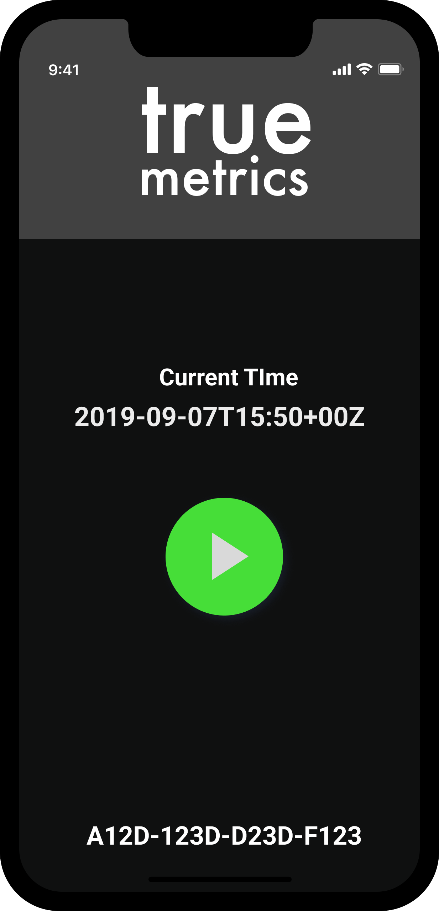

## Setup your development

Learn how to integrate the truemetrics Android SDK into your app.
The other sections of this document describe in detail about how to integrate & use the SDK in your application. 

### How to integrate the SDK

<AccordionGroup>
  <Accordion icon="github" title="Clone your demo application">
    To ensure a smooth intgration in your app, a sample integration with a basic demonstrator app is preparded for you. You can find this repository 
    [here](https://github.com/TRUE-Metrics-io/truemetrics_android_demo_app_p). To clone the repository
    locally, follow these
    [instructions](https://docs.github.com/en/repositories/creating-and-managing-repositories/cloning-a-repository)
    in your terminal.

   
 
  </Accordion>

  <Accordion icon="github" title="Get your SDK API Key">
    For using the SDK to upload data from the integrating app (e.g. your driver app), an API key is required.
    The integrating app has to set this api key (called SDK API KEY) in the initialization of the SDK (see also [here in the docu](/functions)). 

    If you only want to make some first upload tests, you can use our demo SDK API KEY 
    
    `MSgcfnGu0p3E2KhFwTP3N5NSrCSXm54U6DI0PW51`
  </Accordion>

  <Accordion icon="github" title="Connect your Backend">

    The second API key (called RESULTS API KEY) is used when you want to receive the results of a delivery from [https://api.truemetrics.cloud/V2/results](https://api.truemetrics.cloud/V2/results).
    
    If you plan to use all features and to actually receive results, request an API Key by sending us a
    [message](mailto:jan@truemetrics.io). We'll get back to you as fast as possible. 
  </Accordion>

</AccordionGroup>

### App permissions
SDK requires Location permissions (including background location) to collect fused location data that helps our algorithms provide efficient results.
You can refer to Android developers guidelines to integrate location permissions and user consent. 
Additionally, SDK requires permission to post notifications in order to show Foreground service notification. Demo app showcases creating notification channels and asking for permission to post notifications.

###  Software Specifications
Android SDK can run on minimum Android 7.0 (API level 24)
